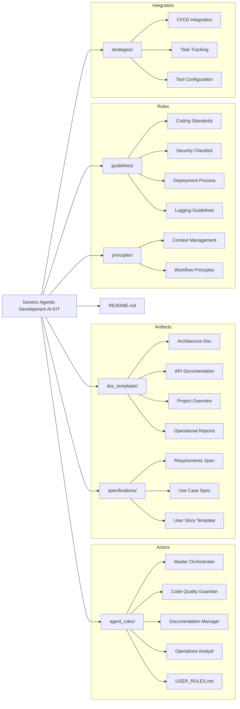
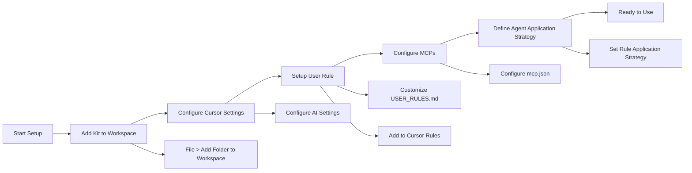
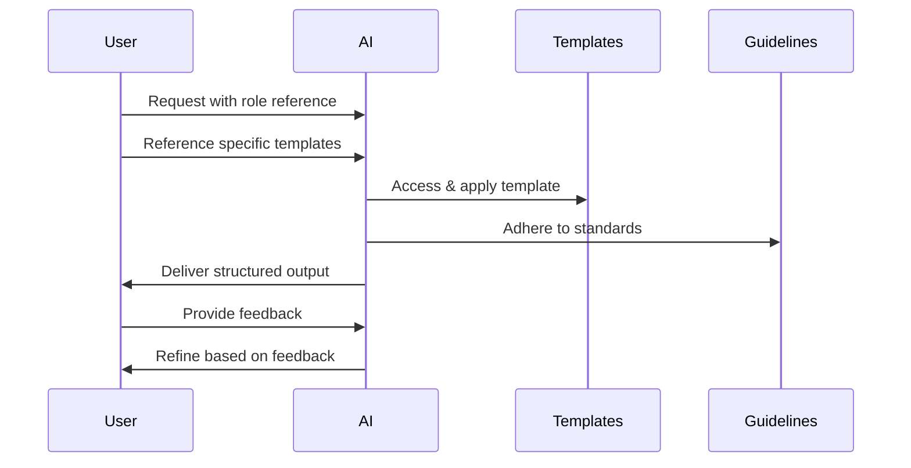

# Generic Agentic Development AI-KIT: Architecture

## Visual Overview

### Component Structure & Relationships

### Setup & Installation Flow

### Typical Usage Workflow

## 1. Purpose & Philosophy

The Generic Agentic Development AI-KIT is a framework-agnostic, language-agnostic toolkit designed to provide a structured foundation for integrating AI agents into the software development lifecycle (SDLC). Its primary purpose is to enhance developer productivity, promote consistency, and facilitate more effective collaboration between humans and AI.

### Core Philosophy: Structured Flexibility

The kit is built on the principle of **structured flexibility**:
- **Adaptability:** Designed to be modified for any project type
- **Consistency:** Promotes uniform documentation and standards
- **Leverage:** Enables effective utilization of AI capabilities
- **Generality:** Remains independent of specific programming languages or frameworks

### Guiding Principles

- **Context-Driven Interaction:** Prioritizes clear context for better AI outcomes
- **Task Isolation:** Focuses each interaction on single, well-defined tasks
- **Standard Reference:** References established standards rather than reinventing them
- **Iterative Refinement:** Starts broad and refines based on responses
- **Role Specialization:** Leverages distinct AI roles for specific SDLC tasks

## 2. Core Components

The kit is organized into distinct directories, each serving a specific purpose:

### `agent_rules/`
Contains templates defining specialized AI agent roles, responsibilities, workflows, and coordination protocols.
- **Master Orchestrator:** Coordinates activities, manages tasks, enforces standards
- **Code Quality Guardian:** Focuses on code review and standards enforcement
- **Documentation Manager:** Specializes in documentation creation and maintenance
- **Operations Analyst:** Concentrates on system health monitoring and optimization
- **USER_RULES.md:** Template for human users to define their role and interaction style

### `doc_templates/`
Provides standardized templates for common project documentation types.
- Architecture overviews, API documentation, project summaries, operational reports, etc.
- Ensures consistency and completeness in project artifacts

### `guidelines/`
Offers templates for establishing project-wide guidelines and best practices.
- Coding standards, security checklists, deployment processes, logging guidelines, etc.
- Serves as reference points for both human and AI evaluations

### `principles/`
Articulates high-level principles for effective human-agent collaboration.
- Context management, workflow approaches, communication patterns, etc.

### `specifications/`
Includes templates for defining requirements and specifications.
- Requirements specifications, use cases, user story templates, etc.

### `strategies/`
Contains documents outlining strategies for integrating agentic workflows with existing development tools.
- Integration with CI/CD, task tracking systems, etc.

### `README.md`
The main entry point providing an overview, setup instructions, usage examples, and customization guidance.

## 3. Component Interactions

The components of the kit interact in complementary ways to support the development workflow:

### Relationship Model
- **Agent Rules & User Rules:** Define the "actors" in the system
- **Doc Templates & Specifications:** Provide the "artifacts" created during development
- **Guidelines & Principles:** Establish the "rules" governing activities
- **Strategies:** Describe "integration points" with external tools/workflows

### Typical Workflow
1. A user adopts a role defined in `USER_RULES.md`
2. They request an AI to adopt a specialized role (e.g., Documentation Manager)
3. They reference specific templates (e.g., API documentation template)
4. The AI, guided by its role definition, creates documentation following the template
5. The work adheres to guidelines referenced by both the user and AI

## 4. Key Features

### Role-Based AI Interaction
- Defines clear roles for AI agents, enabling specialized assistance
- Creates predictable patterns where AI focus aligns with the task at hand
- Reduces need to repeatedly explain what type of assistance is needed

### User Context Definition
- The `USER_RULES.md` template establishes persistent context
- Tailors AI understanding of user's role, project, and preferences
- Reduces friction in communication and aligns with user expectations

### Standardized Templates
- Ensures consistent structure across different documentation types
- Reduces "blank page syndrome" by providing starting points
- Promotes completeness by defining required sections

### Cursor Integration
- Provides guidance for setting up the kit within the Cursor IDE
- Leverages Cursor-specific features for maximum effectiveness
- Includes workspace setup, rule configuration, and agent application strategies

## 5. Intended Usage

### Setup Process
1. Add the kit to your development workspace (e.g., in Cursor)
2. Customize `USER_RULES.md` to define your role and project context
3. Modify any templates or guidelines to match project requirements
4. Configure any relevant Cursor-specific features (e.g., MCPs)

### Interaction Flow
1. Reference relevant kit components when interacting with AI
   - Example: "Adopt the role of Documentation Manager as defined in `agent_rules/documentation_manager_template.md`"
   - Example: "Create API documentation using the template from `doc_templates/API_DOC_template.md`"
2. Provide specific project context alongside kit references
3. Review and iterate on AI outputs as needed

## 6. Extensibility & Applicability

### Customization Potential
- **Modify Templates:** Edit any template to align with specific technologies or requirements
- **Add Content:** Create new roles, templates, or guidelines relevant to your domain
- **Refine Rules:** Adjust details to better reflect actual workflows
- **Integrate Project Specifics:** Fill in placeholders with actual project information

### Cross-Domain Applicability
The kit's generic design makes it suitable for various domains:
- Web development, data science, mobile development, DevOps, enterprise software, etc.
- Can be used by different roles: developers, project managers, QA, technical writers, etc.

### Customization Strategies
- Start with essential components and customize incrementally
- Keep modified kit in version control alongside your project
- Create domain-specific extensions as needed
- Balance standardization with project-specific requirements
