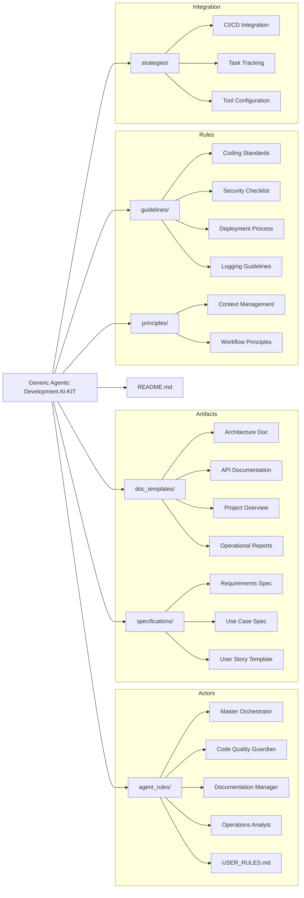
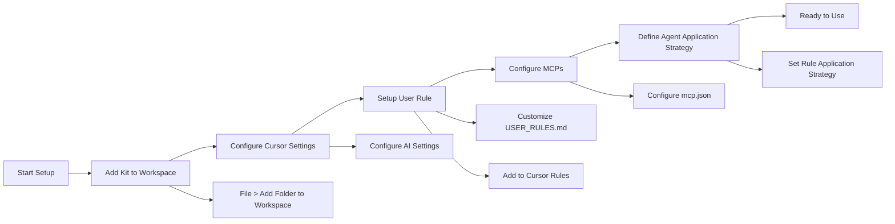
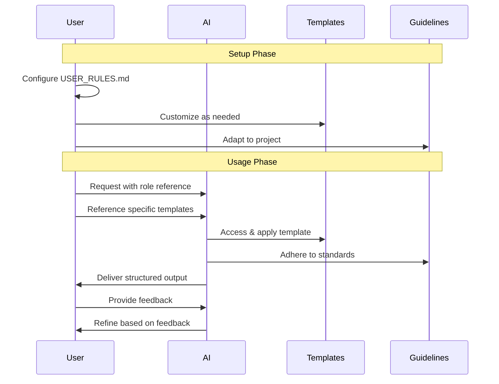
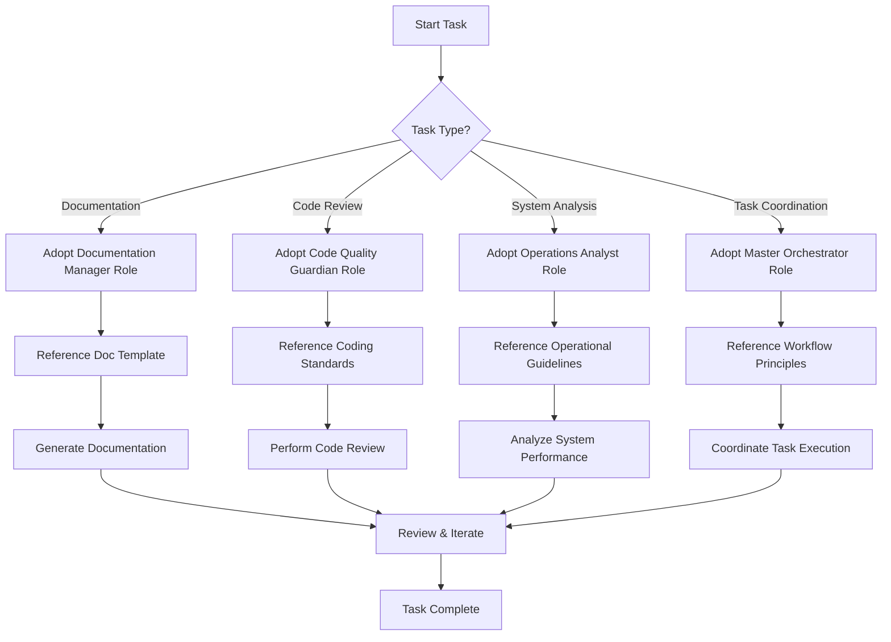
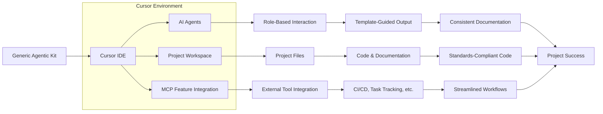
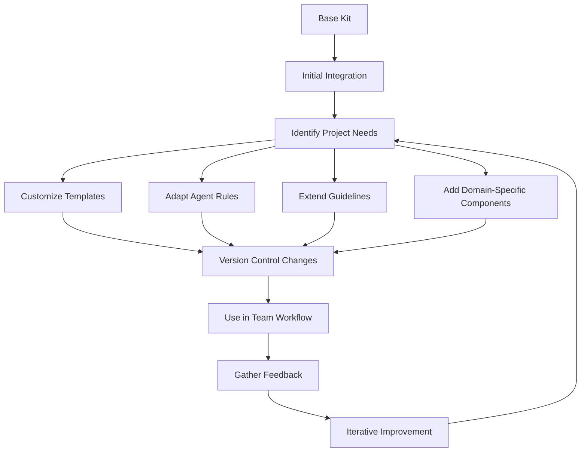

# Generic Agentic Development AI-KIT: Technical Flowchart

## Component Structure & Relationships

## Setup & Installation Flow

## Interaction Workflow

## Task Execution Flow

## Integration with Development Environment

## Customization & Extension Process

