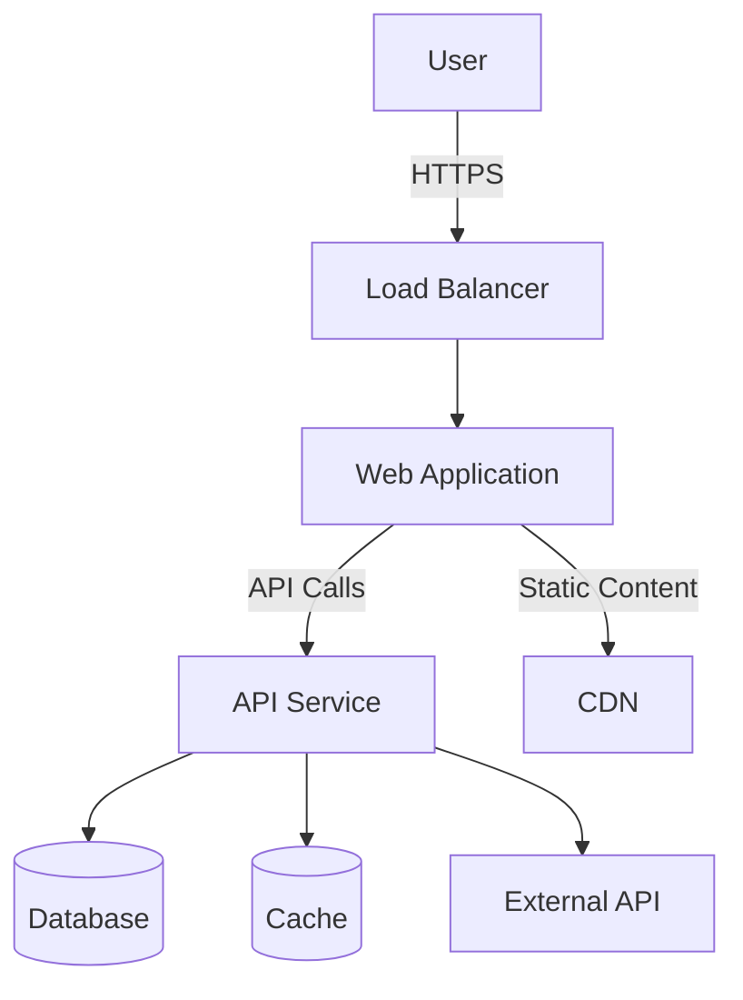
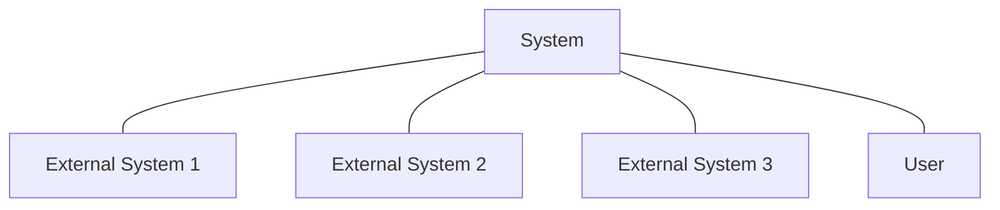
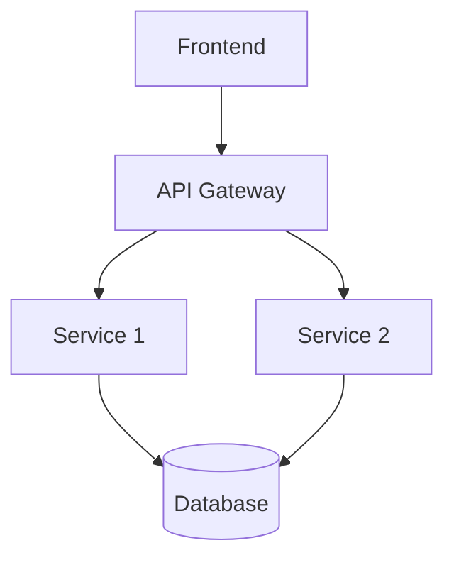
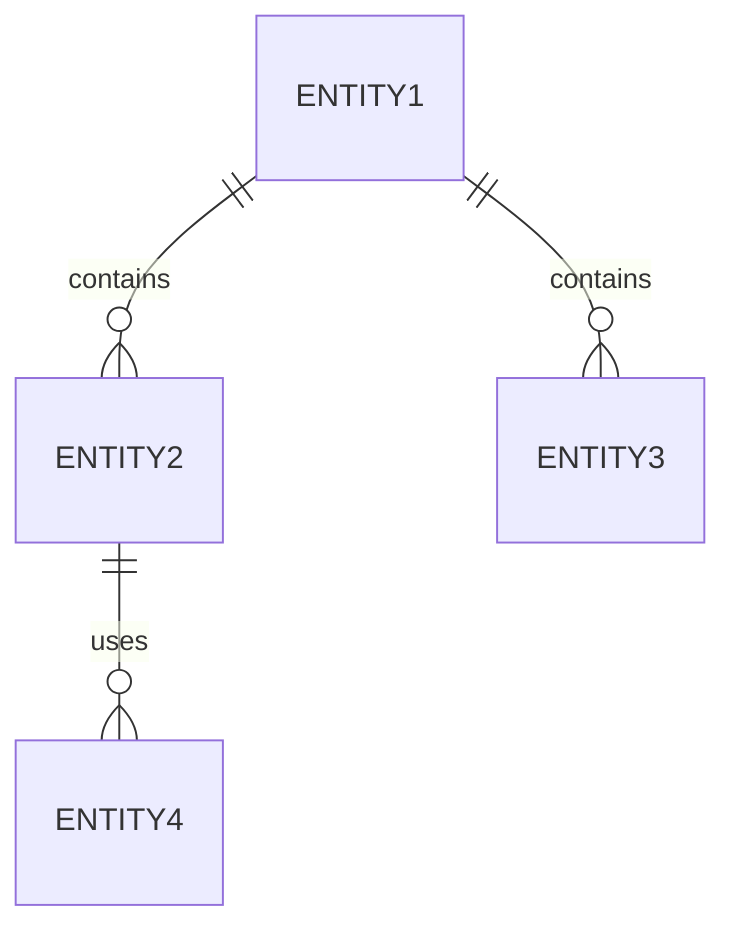
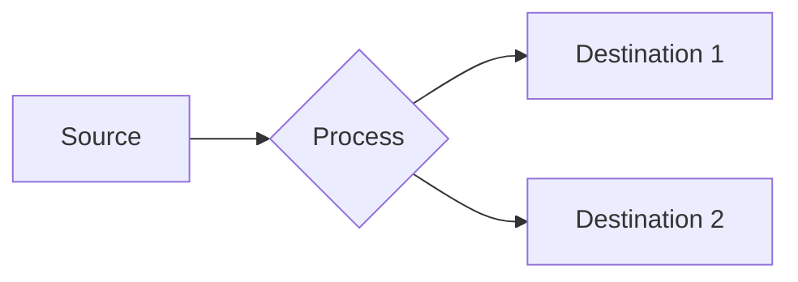
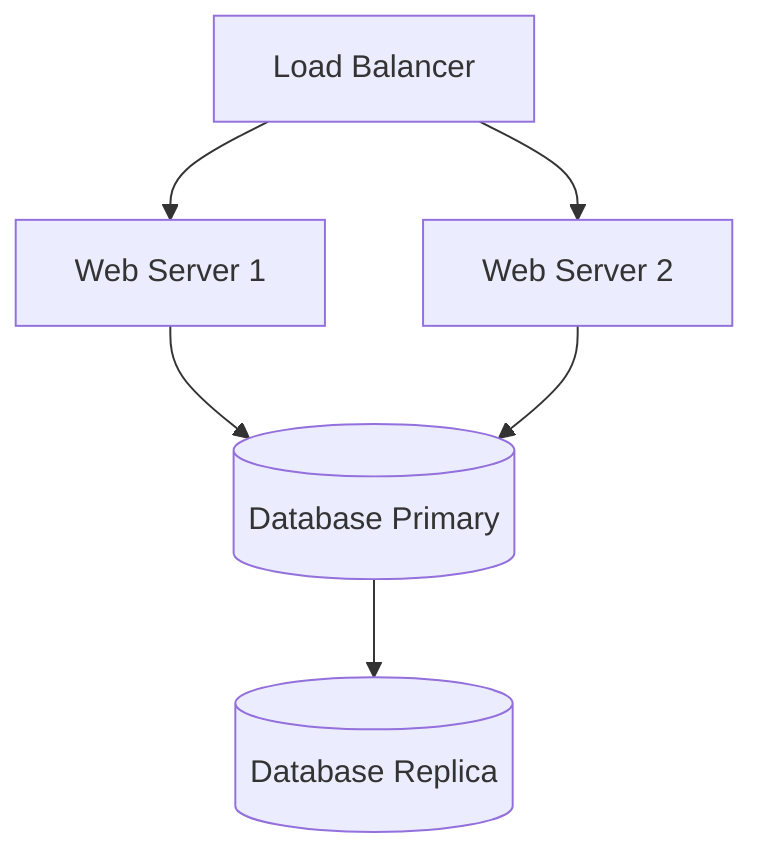

# Architecture Overview: [Project Name]

## 1. Introduction

*   **Purpose:** Briefly describe the system's primary function and goals.
*   **Scope:** Define what is included and excluded from this system.
*   **Audience:** Identify the intended readers (e.g., developers, architects, operations).

## 2. Goals & Constraints

*   **Architectural Goals:** List key quality attributes (e.g., scalability, maintainability, security, performance, reliability).
*   **Technical Constraints:** List any limitations (e.g., specific technology stack, budget, existing infrastructure, compliance requirements).
*   **Business Constraints:** List relevant business limitations (e.g., time-to-market, target user base).

## 3. High-Level Architecture

*   **System Context Diagram:** (Optional: Use Mermaid or describe) Show how the system interacts with external users and systems.
*   **Container/Component Diagram:** (Optional: Use Mermaid or describe) Show the major logical components/services and their responsibilities.
*   **Technology Choices:** List the primary technologies, frameworks, and platforms used and justify key choices.

*(Example Mermaid Diagram)*

## 4. Key Architectural Decisions

*   Document significant design choices made and the rationale behind them.
*   Include trade-offs considered.
    *   *Decision:* [e.g., Choice of Database]
    *   *Rationale:* [e.g., Scalability needs, team familiarity]
    *   *Alternatives Considered:* [e.g., Alternative DB options]
    *   *Trade-offs:* [e.g., Higher cost, learning curve]

## 5. Data Management

*   **Data Model Overview:** Describe the main data entities and their relationships (can include a Mermaid ERD).
*   **Persistence Strategy:** Explain how data is stored (e.g., relational database, NoSQL, file system).
*   **Data Migration:** Outline any data migration considerations.

## 6. Deployment View

*   **Infrastructure Overview:** Describe the target infrastructure (e.g., Cloud provider, On-premise, Kubernetes).
*   **Deployment Strategy:** Explain how the system is deployed (e.g., CI/CD pipeline, manual steps).
*   **Environments:** Describe the different deployment environments (e.g., Dev, Staging, Production).

## 7. Cross-Cutting Concerns

*   **Security:** Outline the approach to authentication, authorization, data protection, etc.
*   **Monitoring & Logging:** Describe how the system will be monitored and what logging practices are in place.
*   **Scalability & Performance:** Detail strategies for handling load and achieving performance goals.
*   **Reliability & Availability:** Explain approaches to fault tolerance and uptime.

## 8. Glossary

*   Define key terms and acronyms used in the document.

## Architecture Overview

### Purpose and Scope
[Brief description of the system's purpose and the scope of this architecture document]

### Key Requirements
- [Requirement 1]
- [Requirement 2]
- [Requirement 3]

### Architecture Principles
- [Principle 1]
- [Principle 2]
- [Principle 3]

## System Context

### Context Diagram

### External Dependencies
| System | Purpose | Interface Type | Data Exchanged |
|--------|---------|----------------|----------------|
| [External System 1] | [Purpose] | [REST, SOAP, etc.] | [Data types] |
| [External System 2] | [Purpose] | [REST, SOAP, etc.] | [Data types] |
| [External System 3] | [Purpose] | [REST, SOAP, etc.] | [Data types] |

## Component Architecture

### High-Level Component Diagram

### Component Descriptions

#### [Component 1]
- **Purpose:** [Description]
- **Responsibilities:**
  - [Responsibility 1]
  - [Responsibility 2]
- **Interfaces:**
  - [Interface 1]
  - [Interface 2]
- **Dependencies:**
  - [Dependency 1]
  - [Dependency 2]

#### [Component 2]
- **Purpose:** [Description]
- **Responsibilities:**
  - [Responsibility 1]
  - [Responsibility 2]
- **Interfaces:**
  - [Interface 1]
  - [Interface 2]
- **Dependencies:**
  - [Dependency 1]
  - [Dependency 2]

## Data Architecture

### Data Model Overview
[Brief description of the data model]

### Key Entities

### Data Flow Diagram

### Data Storage
| Storage Type | Purpose | Data Categories | Retention Policy |
|--------------|---------|-----------------|------------------|
| [Database] | [Purpose] | [Categories] | [Policy] |
| [File Storage] | [Purpose] | [Categories] | [Policy] |
| [Cache] | [Purpose] | [Categories] | [Policy] |

## API Architecture

### API Design Principles
- [Principle 1]
- [Principle 2]
- [Principle 3]

### API Endpoints
| Endpoint | Method | Purpose | Authentication |
|----------|--------|---------|----------------|
| [/path] | [GET/POST/etc.] | [Purpose] | [Auth type] |
| [/path] | [GET/POST/etc.] | [Purpose] | [Auth type] |
| [/path] | [GET/POST/etc.] | [Purpose] | [Auth type] |

### Authentication and Authorization
[Description of authentication and authorization mechanisms]

## Security Architecture

### Security Principles
- [Principle 1]
- [Principle 2]
- [Principle 3]

### Security Controls
| Category | Control | Implementation |
|----------|---------|----------------|
| Authentication | [Control] | [Implementation details] |
| Authorization | [Control] | [Implementation details] |
| Data Protection | [Control] | [Implementation details] |
| Network Security | [Control] | [Implementation details] |

### Threat Model
| Threat | Risk Level | Mitigation Strategy |
|--------|------------|---------------------|
| [Threat 1] | [High/Medium/Low] | [Strategy] |
| [Threat 2] | [High/Medium/Low] | [Strategy] |
| [Threat 3] | [High/Medium/Low] | [Strategy] |

## Deployment Architecture

### Deployment Diagram

### Environment Configuration
| Environment | Infrastructure | Configuration | Purpose |
|-------------|---------------|---------------|---------|
| Development | [Description] | [Configuration] | [Purpose] |
| Staging | [Description] | [Configuration] | [Purpose] |
| Production | [Description] | [Configuration] | [Purpose] |

### Scalability Considerations
- [Consideration 1]
- [Consideration 2]
- [Consideration 3]

## Performance Architecture

### Performance Requirements
| Metric | Target | Measurement Method |
|--------|--------|-------------------|
| [Response Time] | [Target] | [Method] |
| [Throughput] | [Target] | [Method] |
| [Concurrency] | [Target] | [Method] |

### Performance Optimization Strategies
- [Strategy 1]
- [Strategy 2]
- [Strategy 3]

### Caching Strategy
| Cache Type | Purpose | Invalidation Strategy | TTL |
|------------|---------|------------------------|-----|
| [Type] | [Purpose] | [Strategy] | [Time] |
| [Type] | [Purpose] | [Strategy] | [Time] |

## Reliability Architecture

### Reliability Requirements
- [Requirement 1]
- [Requirement 2]
- [Requirement 3]

### Failure Modes and Recovery
| Failure Mode | Impact | Detection Method | Recovery Strategy |
|--------------|--------|------------------|-------------------|
| [Mode] | [Impact] | [Method] | [Strategy] |
| [Mode] | [Impact] | [Method] | [Strategy] |

### Backup and Disaster Recovery
[Description of backup and disaster recovery strategy]

## Technical Debt and Future Evolution

### Known Technical Debt
- [Debt Item 1]
- [Debt Item 2]
- [Debt Item 3]

### Evolution Strategy
[Description of how the architecture is expected to evolve]

### Planned Improvements
- [Improvement 1]
- [Improvement 2]
- [Improvement 3]

## Appendix

### Glossary
| Term | Definition |
|------|------------|
| [Term 1] | [Definition] |
| [Term 2] | [Definition] |
| [Term 3] | [Definition] |

### References
- [Reference 1]
- [Reference 2]
- [Reference 3]

### Decision Records
| Decision | Rationale | Alternatives Considered | Date |
|----------|-----------|-------------------------|------|
| [Decision 1] | [Rationale] | [Alternatives] | [Date] |
| [Decision 2] | [Rationale] | [Alternatives] | [Date] | 