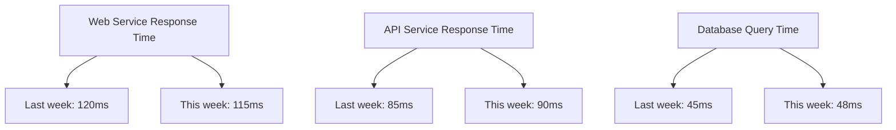
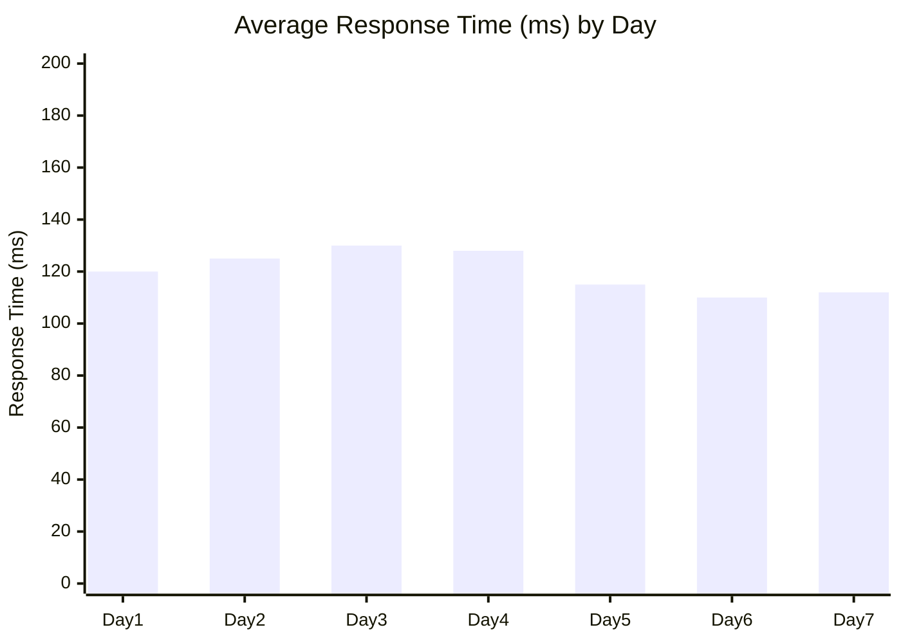
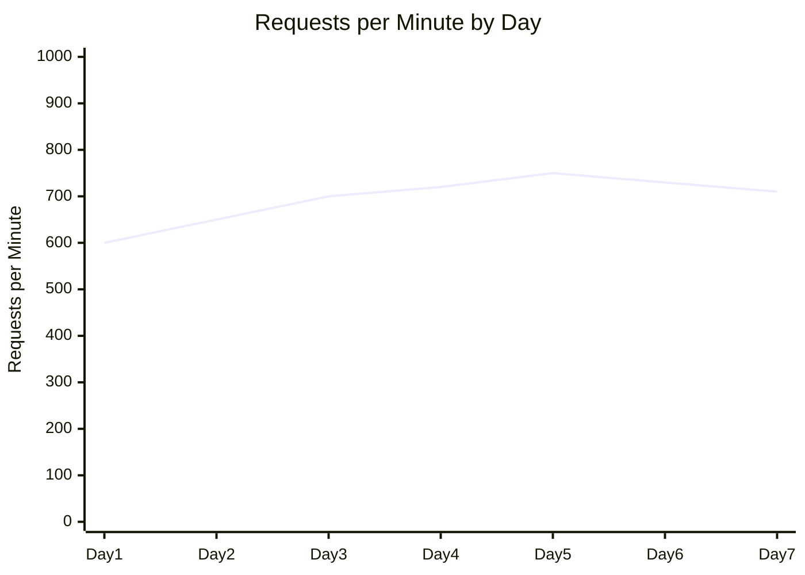
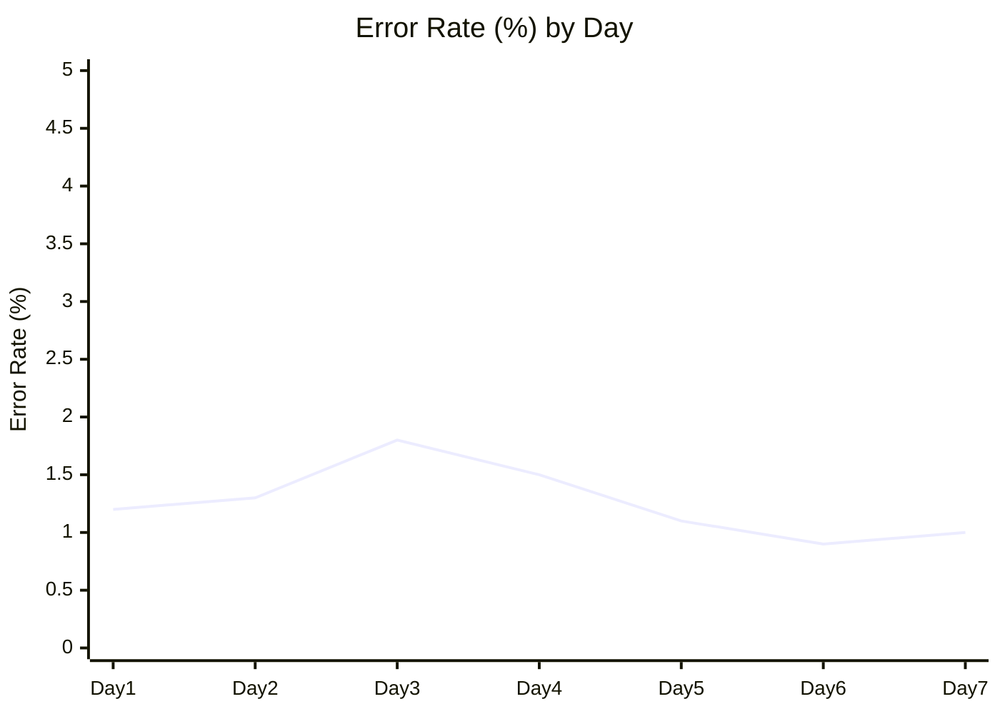
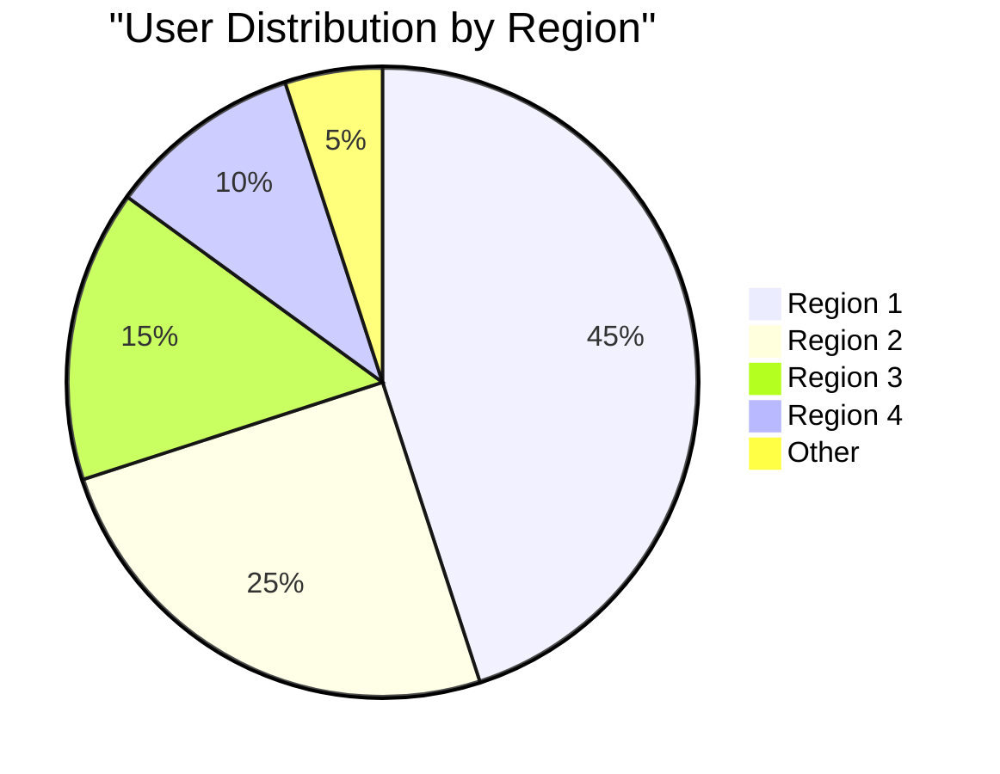
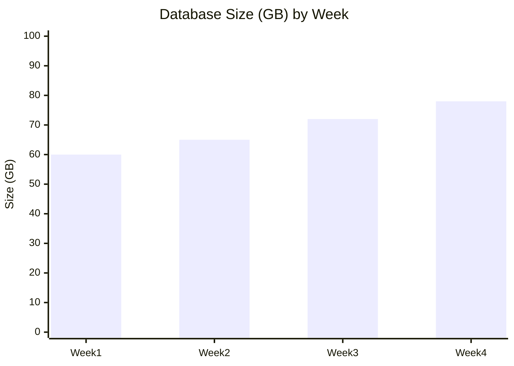

# Operational Report

<!-- Operational Report Metadata - Do not remove -->
```
{
  "project_name": "[Project Name]",
  "report_period": "YYYY-MM-DD to YYYY-MM-DD",
  "report_version": "0.0.1",
  "report_author": "[Name/ID]",
  "generated_date": "YYYY-MM-DD"
}
```
<!-- End Metadata -->

## Executive Summary

### Key Findings
- [Finding 1]
- [Finding 2]
- [Finding 3]

### Critical Issues
- [Issue 1]
- [Issue 2]
- [Issue 3]

### Recommendations
- [Recommendation 1]
- [Recommendation 2]
- [Recommendation 3]

## System Health Overview

### Availability Metrics
| Environment | Uptime | Planned Downtime | Unplanned Downtime | SLA Compliance |
|-------------|--------|------------------|-------------------|----------------|
| Production | [%] | [Duration] | [Duration] | [Yes/No] |
| Staging | [%] | [Duration] | [Duration] | [Yes/No] |
| Development | [%] | [Duration] | [Duration] | [Yes/No] |

### Health Status by Component
| Component | Status | Trend | Notes |
|-----------|--------|-------|-------|
| [Component 1] | [Healthy/Degraded/Critical] | [Improving/Stable/Declining] | [Notes] |
| [Component 2] | [Healthy/Degraded/Critical] | [Improving/Stable/Declining] | [Notes] |
| [Component 3] | [Healthy/Degraded/Critical] | [Improving/Stable/Declining] | [Notes] |

### Service Level Indicator (SLI) Performance


## Performance Analysis

### Response Time Trends


### Throughput Analysis


### Resource Utilization
| Resource | Average | Peak | Trend | Threshold | Actions |
|----------|---------|------|-------|-----------|---------|
| CPU | [%] | [%] | [Trend] | [%] | [Actions] |
| Memory | [%] | [%] | [Trend] | [%] | [Actions] |
| Disk Space | [%] | [%] | [Trend] | [%] | [Actions] |
| Network | [Mbps] | [Mbps] | [Trend] | [Mbps] | [Actions] |

## Error Analysis

### Error Rate Trends


### Top Error Categories
| Error Type | Count | % of Total | Primary Locations | Trend | Priority |
|------------|-------|------------|-------------------|-------|----------|
| [Error 1] | [Count] | [%] | [Locations] | [Trend] | [High/Medium/Low] |
| [Error 2] | [Count] | [%] | [Locations] | [Trend] | [High/Medium/Low] |
| [Error 3] | [Count] | [%] | [Locations] | [Trend] | [High/Medium/Low] |

### Critical Error Analysis
#### [Error Type 1]
- **Occurrences:** [Count]
- **Impact:** [Description of impact]
- **Root Cause:** [Description of root cause]
- **Resolution Status:** [Status]
- **Mitigation Plan:** [Plan]

#### [Error Type 2]
- **Occurrences:** [Count]
- **Impact:** [Description of impact]
- **Root Cause:** [Description of root cause]
- **Resolution Status:** [Status]
- **Mitigation Plan:** [Plan]

## User Activity

### User Session Metrics
| Metric | Value | Change vs Previous | Threshold | Status |
|--------|-------|-------------------|-----------|--------|
| Active Users | [Count] | [+/-X%] | [Threshold] | [Status] |
| Avg. Session Duration | [Duration] | [+/-X%] | [Threshold] | [Status] |
| Session Count | [Count] | [+/-X%] | [Threshold] | [Status] |
| Bounce Rate | [%] | [+/-X%] | [Threshold] | [Status] |

### Top User Activities
| Activity | Count | % of Total | Trend |
|----------|-------|------------|-------|
| [Activity 1] | [Count] | [%] | [Trend] |
| [Activity 2] | [Count] | [%] | [Trend] |
| [Activity 3] | [Count] | [%] | [Trend] |

### Geographic Distribution


## Database Performance

### Query Performance
| Query Type | Avg. Time | Max Time | Execution Count | Trend |
|------------|-----------|----------|-----------------|-------|
| [Type 1] | [Time] | [Time] | [Count] | [Trend] |
| [Type 2] | [Time] | [Time] | [Count] | [Trend] |
| [Type 3] | [Time] | [Time] | [Count] | [Trend] |

### Slow Queries
| Query | Time | Count | Impact | Optimization Status |
|-------|------|-------|--------|---------------------|
| [Query 1] | [Time] | [Count] | [Impact] | [Status] |
| [Query 2] | [Time] | [Count] | [Impact] | [Status] |
| [Query 3] | [Time] | [Count] | [Impact] | [Status] |

### Database Growth


## Security and Compliance

### Security Incidents
| Incident Type | Count | Severity | Status | Resolution |
|---------------|-------|----------|--------|------------|
| [Type 1] | [Count] | [High/Medium/Low] | [Status] | [Resolution] |
| [Type 2] | [Count] | [High/Medium/Low] | [Status] | [Resolution] |
| [Type 3] | [Count] | [High/Medium/Low] | [Status] | [Resolution] |

### Authentication Metrics
| Metric | Count | Change vs Previous | Threshold | Status |
|--------|-------|-------------------|-----------|--------|
| Failed Logins | [Count] | [+/-X%] | [Threshold] | [Status] |
| Password Resets | [Count] | [+/-X%] | [Threshold] | [Status] |
| Account Lockouts | [Count] | [+/-X%] | [Threshold] | [Status] |
| New Accounts | [Count] | [+/-X%] | [Threshold] | [Status] |

### Compliance Status
| Requirement | Status | Issues | Due Date | Actions |
|-------------|--------|--------|----------|---------|
| [Req. 1] | [Compliant/Non-Compliant] | [Issues] | [Date] | [Actions] |
| [Req. 2] | [Compliant/Non-Compliant] | [Issues] | [Date] | [Actions] |
| [Req. 3] | [Compliant/Non-Compliant] | [Issues] | [Date] | [Actions] |

## Recent Changes

### Deployments
| Deployment | Date | Components | Status | Issues |
|------------|------|------------|--------|--------|
| [Deployment 1] | [Date] | [Components] | [Status] | [Issues] |
| [Deployment 2] | [Date] | [Components] | [Status] | [Issues] |
| [Deployment 3] | [Date] | [Components] | [Status] | [Issues] |

### Configuration Changes
| Change | Date | Components | Impact | Status |
|--------|------|------------|--------|--------|
| [Change 1] | [Date] | [Components] | [Impact] | [Status] |
| [Change 2] | [Date] | [Components] | [Impact] | [Status] |
| [Change 3] | [Date] | [Components] | [Impact] | [Status] |

### Maintenance Activities
| Activity | Date | Duration | Impact | Status |
|----------|------|----------|--------|--------|
| [Activity 1] | [Date] | [Duration] | [Impact] | [Status] |
| [Activity 2] | [Date] | [Duration] | [Impact] | [Status] |
| [Activity 3] | [Date] | [Duration] | [Impact] | [Status] |

## Issues and Action Items

### Open Issues
| Issue ID | Description | Priority | Owner | Due Date | Status |
|----------|-------------|----------|-------|----------|--------|
| [ID-001] | [Description] | [High/Medium/Low] | [Owner] | [Date] | [Status] |
| [ID-002] | [Description] | [High/Medium/Low] | [Owner] | [Date] | [Status] |
| [ID-003] | [Description] | [High/Medium/Low] | [Owner] | [Date] | [Status] |

### Resolved Issues
| Issue ID | Description | Resolution | Resolved Date |
|----------|-------------|------------|---------------|
| [ID-004] | [Description] | [Resolution] | [Date] |
| [ID-005] | [Description] | [Resolution] | [Date] |
| [ID-006] | [Description] | [Resolution] | [Date] |

### Action Items
| Item ID | Description | Owner | Due Date | Status |
|---------|-------------|-------|----------|--------|
| [AI-001] | [Description] | [Owner] | [Date] | [Status] |
| [AI-002] | [Description] | [Owner] | [Date] | [Status] |
| [AI-003] | [Description] | [Owner] | [Date] | [Status] |

## Appendix

### Monitoring Configuration
[Description of monitoring tools and configurations]

### Data Collection Methodology
[Description of how metrics were collected and analyzed]

### Report Generation Process
[Description of how this report was generated]

### Glossary
| Term | Definition |
|------|------------|
| [Term 1] | [Definition] |
| [Term 2] | [Definition] |
| [Term 3] | [Definition] | 