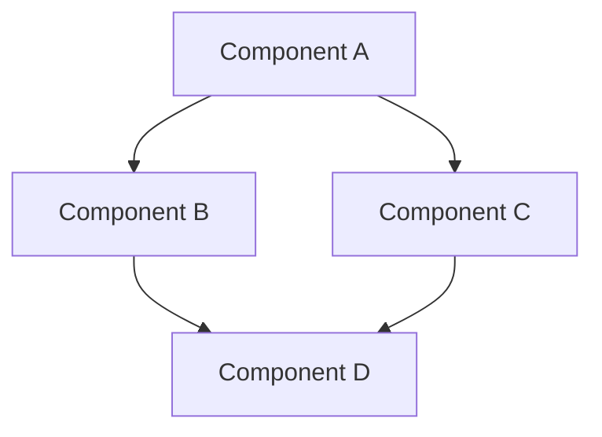
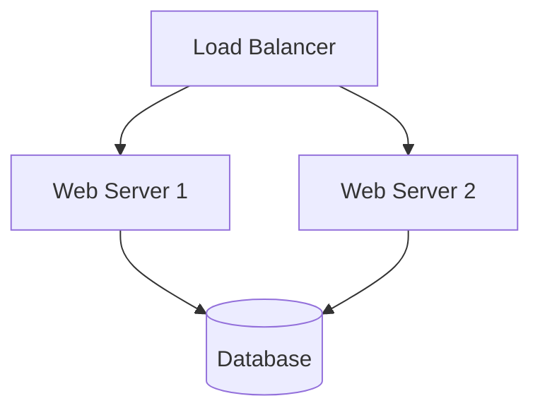

# Project Overview: [Project Name]

<!-- Project Metadata - Do not remove -->
```
{
  "project_name": "[Project Name]",
  "version": "0.0.1",
  "last_updated": "YYYY-MM-DD",
  "status": "[In Development/Active/Maintenance/Archived]",
  "organization": "[Organization Name]",
  "project_leads": [
    {"name": "[Lead Name]", "role": "[Role]", "contact": "[Email/Contact Info]"}
  ]
}
```
<!-- End Metadata -->

## Vision and Objectives

### Project Vision
[Concise statement of the project's purpose and intended impact]

### Key Objectives
- [Objective 1]
- [Objective 2]
- [Objective 3]

### Success Criteria
- [Measurable outcome 1]
- [Measurable outcome 2]
- [Measurable outcome 3]

## System Architecture

### Architecture Overview
[Brief description of the overall system architecture]

### System Component Diagram


### Technology Stack
| Layer | Technologies |
|-------|--------------|
| Frontend | [Technologies] |
| Backend | [Technologies] |
| Database | [Technologies] |
| Infrastructure | [Technologies] |
| Tools | [Technologies] |

## Key Components

### Component Relationships
[Description of how the main components interact]

### Critical Paths
[Identification of the most important workflows or data flows]

### External Integrations
- [Integration 1]: [Description]
- [Integration 2]: [Description]
- [Integration 3]: [Description]

## Deployment Environments

### Environment Overview
| Environment | Purpose | Access | Update Frequency |
|-------------|---------|--------|------------------|
| Development | [Purpose] | [Access details] | [Frequency] |
| Staging | [Purpose] | [Access details] | [Frequency] |
| Production | [Purpose] | [Access details] | [Frequency] |

### Infrastructure Diagram


## Key Stakeholders

### Project Team
- [Team Member 1]: [Role]
- [Team Member 2]: [Role]
- [Team Member 3]: [Role]

### Business Stakeholders
- [Stakeholder 1]: [Department/Role]
- [Stakeholder 2]: [Department/Role]
- [Stakeholder 3]: [Department/Role]

### External Stakeholders
- [Stakeholder 1]: [Organization/Role]
- [Stakeholder 2]: [Organization/Role]
- [Stakeholder 3]: [Organization/Role]

## Project Timeline

### Major Milestones
- [Milestone 1]: [Date]
- [Milestone 2]: [Date]
- [Milestone 3]: [Date]

### Current Phase
[Description of the current project phase and objectives]

### Next Steps
- [Next step 1]
- [Next step 2]
- [Next step 3]

## Additional Resources

### Related Documents
- [Document 1]: [Link/Path]
- [Document 2]: [Link/Path]
- [Document 3]: [Link/Path]

### External References
- [Reference 1]: [Link]
- [Reference 2]: [Link]
- [Reference 3]: [Link]

### Contact Information
For questions or support regarding this project, please contact:
- [Name]: [Email] - [Area of responsibility]
- [Name]: [Email] - [Area of responsibility] 